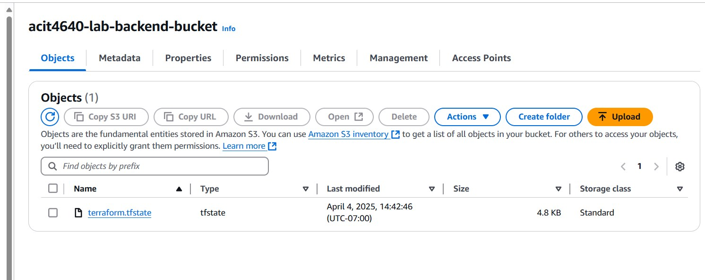
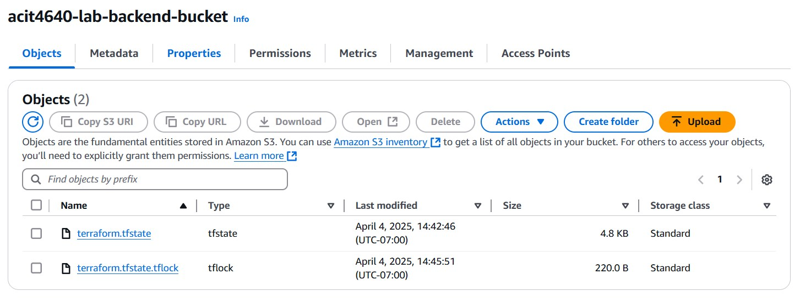

# 4640-w13-lab-start-w25

Screenshot of the S3 bucket with only state file



Screnshot of the S3 bucket with state file and lock file


State file is created after you enter 'yes' whey you perform ```terraform apply```

Lock file is created when you perform ```terraform apply``` and BEFORE you enter 'yes'. This is because the lock file 'locks' the state file while it's being created to prevent conflict when multiple users attempt to make changes to the state file. Once the state file is created, the lock file will no longer exist in the bucket.